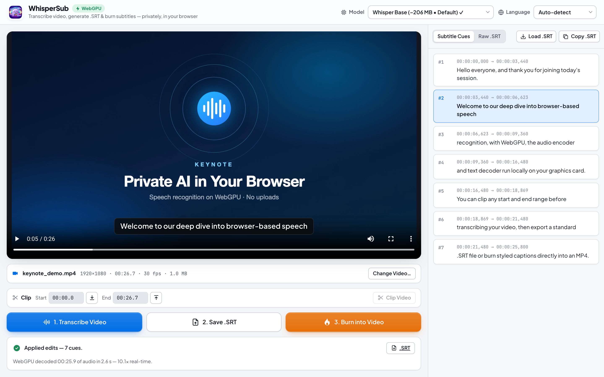
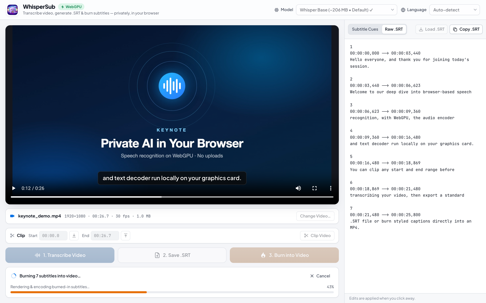

# WhisperSub Web

The browser version of WhisperSub. It transcribes videos with **OpenAI Whisper running locally on your GPU (WebGPU)**, exports `.srt` files, clips by start/end time, and burns styled captions into an MP4. Everything runs on your device. Videos and audio are never uploaded.

**Live:** https://whispersub-web.web.app/

## Screenshots

<p align="center">
  
</p>

<p align="center">
  
</p>

## macOS app vs. web app

| | macOS app | Web app |
|---|---|---|
| Inference | WhisperKit · CoreML on the Apple Neural Engine | Transformers.js · ONNX Runtime on **WebGPU** (WASM/CPU fallback) |
| Models | Tiny · Base (default) · Small · Large v3 Turbo | Same four (`onnx-community/whisper-*`) |
| Model cache | `~/Library/Application Support/WhisperSub` | Browser Cache Storage (marked ✓ in the picker) |
| Language | Auto-detect | Auto-detect, or pick a language manually |
| Video I/O | AVFoundation + CoreImage (ffmpeg fallback) | **WebCodecs** via [Mediabunny] (hardware encode/decode) |
| Containers | .mp4 .mov .m4v .avi .webm .mkv | .mp4 .mov .m4v .webm .mkv (and anything Mediabunny can demux) |
| Output | `.srt` + burned `.mp4` | `.srt` + burned `.mp4` (H.264 + AAC when available) |

## Workflow

1. **Drop a video.** If you drop a matching `.srt` alongside it, that file loads too, just like the companion `.srt` in the native app.
2. **Optional clip.** Set Start/End manually or from the playhead. Clipping runs automatically before transcription, and the clip can be downloaded.
3. **Transcribe.** Audio is decoded to 16 kHz mono and cut at quiet points into ≤30 s windows. Each window is decoded on the GPU, and cues appear in the list as they're produced.
4. **Save .SRT / Burn into Video.** The burned captions use the same pill style as the native compositor: font scale, padding, corner radius, shadow, and bottom margin.

The **Raw .SRT** tab is editable. Changes are applied when you click away, so you can fix transcription mistakes before burning.

## Running locally

There is no build step. Serve the `public/` folder over HTTP:

```bash
npm start          # → http://127.0.0.1:5173  (uses python3 -m http.server)
npm test           # SRT parsing / cue-building unit tests (Node 18+)
```

Opening `index.html` via `file://` won't work, because module workers need HTTP.

## Browser support

- **Best:** Chrome / Edge 113+ (WebGPU + WebCodecs incl. H.264 & AAC encoding).
- **Works:** Safari 17+ (WebCodecs; WebGPU in Safari 26+). Firefox 130+ runs on CPU until WebGPU is enabled for you.
- First use downloads the model (~120 MB for Tiny up to ~1.6 GB for Large v3 Turbo). Later runs load from the browser cache.

## Deploying

The app is fully static and is hosted on Firebase Hosting (site `whispersub-web`):

```bash
npm run deploy     # firebase deploy --only hosting
```

## Files

```
public/
├── index.html               App shell (mirrors ContentView.swift)
├── css/app.css              Design system shared with the landing page (light + dark)
├── assets/icon.png
└── js/
    ├── app.js               Controller (AppViewModel.swift)
    ├── srt.js               SRTFormatter / SubtitleCue / cue building (SubtitleModels.swift)
    ├── media.js             Inspect · clip · 16 kHz audio · burn (VideoSubtitleBurner.swift)
    ├── subtitle-renderer.js Caption pill rasterizer (SubtitleOverlayCache)
    ├── whisper.worker.js    Whisper inference worker (WhisperTranscriptionService.swift)
    └── models.js            Model catalog, WebGPU detection, cache detection
tests/srt.test.mjs           Unit tests
```

The Swift file names refer to the native macOS app, [WhisperSub](https://github.com/windmaple/WhisperSub).

[Mediabunny]: https://mediabunny.dev
